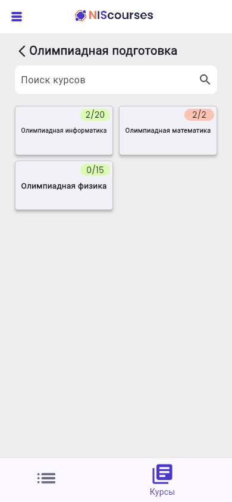
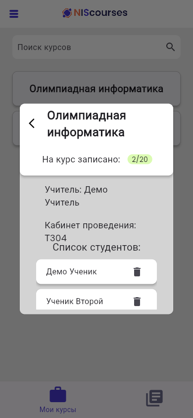
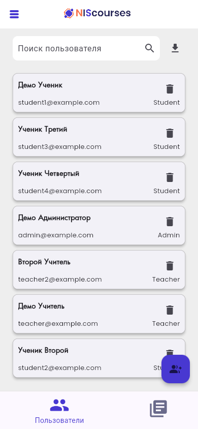

<p align="center">
  
</p>

# NIScourses

NIScourses is a full course-enrollment system for NIS (Nazarbayev Intellectual School) in Petropavlovsk. It replaces paper sign-up sheets with one app for the whole school. Students claim seats in real time, teachers see their rosters fill up live, and admins run the entire catalogue (accounts, sections, courses, schedules) and export the school's enrollment to Excel in one click.

One Flutter codebase serves three roles (Student, Teacher, Admin) on Firebase Authentication and the Realtime Database. Seat counters, rosters and schedules update in real time on every connected device, and the layout adapts from phones to desktop browsers.

A team of three built it in summer 2023, **without any AI coding tools**. Every screen, data model and enrollment rule was designed and written by hand.

<p align="center">
  
  
  
  
</p>
<p align="center">
  
  
  
</p>

<p align="center"><sub>Screenshots: web build running against the Firebase Local Emulator Suite with made-up sample data.</sub></p>

## Roles and features

After sign-in the app reads the user's `role` from the database and routes them into one of three purpose-built experiences.

**Student**
- **Personal timetable.** A schedule generated automatically from the courses the student joined. Step through the week day by day. Each day lists the student's courses with room, teacher and time, sorted by start time.
- **Live enrollment.** Courses are grouped into sections, and seat availability updates in real time. Each course card shows a `count/max` seat badge, green while seats are left and red when full. The course dialog shows the teacher and room and has a sign-up or leave button.
- **Fair-enrollment rule.** A student can hold one course of each type: "1 курс/2 курс" (main course), "Кружки" (clubs) and "Секция" (sports sections). Signing up for a second one of the same type is refused.
- **Side drawer** with the student's email, their current course of each type, and logout.

**Teacher**
- **My courses.** A list of the courses the teacher leads. Opening one shows the enrolled students, and the teacher can remove a student from the course.
- Can browse all sections and courses like a student, without the sign-up button.

**Admin**
- **User management.** List of all users with search by name, email or class. Add teacher or student accounts. Delete users: students are also removed from their courses, and teachers who still lead courses can't be deleted.
- **Excel export.** One button downloads `Пользователи.xlsx` with sheets for admins, teachers and students. The student sheet shows each student's courses by type and a color-coded count of how many types they have signed up for.
- **Sections and courses.** Create a section and choose its type. Create a course with a name, a teacher picked from a searchable dropdown, room, seat limit, and up to seven weekday/time slots chosen with a time picker. Delete courses or whole sections. Deleting also clears related enrollments.

On wide screens (wider than tall) the drawer becomes a fixed sidebar and the login page shows the illustration next to the form.

## Tech stack

| | |
|---|---|
| App | Flutter, Dart SDK `>=2.19.2 <3.0.0` (from `pubspec.yaml`) |
| Auth | Firebase Authentication, email and password (`firebase_auth`) |
| Database | Firebase Realtime Database (`firebase_database`) |
| UI packages | [awesome_dialog](https://pub.dev/packages/awesome_dialog) for result dialogs, [dropdown_search](https://pub.dev/packages/dropdown_search) for the teacher picker |
| Export | [excel](https://pub.dev/packages/excel) for the `.xlsx` user export |

## Architecture

The app is serverless: the Flutter client talks to Firebase directly and subscribes to Realtime Database streams, so every seat counter, roster and schedule stays in sync across devices without a refresh.

```text
Firebase Auth (email/password)
        │ uid
        ▼
Realtime Database
├── users/{uid}        fio, email, role (Student | Teacher | Admin), grade, courses
├── topics/{name}      razdel (section type), courses: [course names]
└── courses/{name}     teacher, cabinet, max, schedule {weekday: "HH:MM-HH:MM"}, students {uid: true}
```

- `lib/Auth.dart` listens to the sign-in state, reads `users/{uid}/role` and opens the matching home screen.
- A student's `courses` maps the section type to one course name, which is how the one-per-type rule is enforced. A teacher's `courses` is a set of course names.
- Enrollment writes to both `courses/{name}/students` and `users/{uid}/courses`. The seat counter is the size of `students`.

```text
lib/
├── main.dart                     # Firebase init, app theme, roles enum
├── Auth.dart                     # Sign-in state and role routing
├── side_bar.dart                 # Drawer / desktop sidebar
├── createnewuser.dart            # Admin: add teacher or student
├── create_excel.dart             # Admin: Excel export
└── pages/
    ├── LoginPage.dart
    ├── main_page.dart            # Scaffold, role-based tabs and action buttons
    ├── schedule.dart             # Student schedule
    ├── users_page.dart           # Admin: user list, search, delete
    └── courses/
        ├── all_topics.dart           # Sections
        ├── topic_courses.dart        # Courses in a section
        ├── course_info_dialog.dart   # Details, sign up / leave, student list
        ├── teacherCourses.dart       # Teacher: my courses
        ├── createnewchapter.dart     # Admin: new section
        └── createnewcourse.dart      # Admin: new course
```

## Run locally

You need the [Flutter SDK](https://docs.flutter.dev/get-started/install) and your own Firebase project. The app has only been checked on the web target.

1. **Create a Firebase project** and register a web app.
2. **Enable Authentication → Email/Password** and **create a Realtime Database**. The repo has no security rules file, so set rules that at least require sign-in, for example `{"rules": {".read": "auth != null", ".write": "auth != null"}}`.
3. **Point the app at your project.** Replace the `FirebaseOptions` values in `lib/main.dart` (`apiKey`, `authDomain`, `databaseURL`, `projectId`, `storageBucket`, `messagingSenderId`, `appId`, `measurementId`) with your web app's config. `web/index.html` also contains a separate Firebase config script that the Dart code doesn't use. Remove it or replace it with your own values.
4. **Create the first admin.** In the console, add a user under Authentication, then add a node `users/<that uid>` with `email`, `fio` and `"role": "Admin"` in the Realtime Database. Without a `users/{uid}` entry the app stays on the loading screen after sign-in.
5. **Set the admin account used by the admin screens.** Adding and deleting users signs the admin back in with an email and password hard-coded in `lib/createnewuser.dart` and `lib/pages/users_page.dart`. Change them to your admin account.
6. Run it:

```bash
git clone https://github.com/Akanov-Kanta/Courses.git
cd Courses
flutter pub get
flutter run -d chrome
```

### Building on current Flutter

The code targets the Flutter of 2023 (Dart 2.19). To build it on Flutter 3.32 / Dart 3.8, apply these updates (they're how the screenshots above were built):

- Rename `primary:` to `backgroundColor:` in `ElevatedButton.styleFrom(...)` in `lib/pages/LoginPage.dart`, `lib/createnewuser.dart` (2 places), `lib/pages/courses/createnewchapter.dart` and `lib/pages/courses/createnewcourse.dart`.
- Add `archive: ^3.6.1` under `dependency_overrides`. The locked `archive 3.3.7`, pulled in by `excel`, uses typed-data classes that newer Dart removed.
- `dropdown_search 3.0.1` uses removed Flutter APIs (`subtitle1`, `subtitle2`, `isAlwaysShown`, `showTrackOnHover`). Either patch a local copy or upgrade the package and update the `DropdownSearch` call in `createnewcourse.dart`, since its API changed in later major versions.

## Credits

Built by [@Akanov-Kanta](https://github.com/Akanov-Kanta), [@RandomnieBukvi](https://github.com/RandomnieBukvi) and [@chillit](https://github.com/chillit).

## License

MIT. See [LICENSE](LICENSE).
